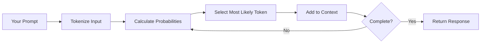

TL;DR, A picture is worth a thousand words.


Here is the longer version...
---

# Why Does ChatGPT Sound So Smart When It's Just Guessing?

*The Pattern-Matching Illusion Every Engineer Should Understand*

You ask ChatGPT to debug your Python code, and it provides a detailed explanation of why your loop isn't working. It sounds confident, knowledgeable, even insightful. But here's the twist: it's essentially playing an incredibly sophisticated game of autocomplete.

As IT engineers, understanding this distinction isn't academic—it's practical. Once you grasp how GenAI actually works, you'll debug AI interactions like any other system: by understanding the underlying mechanics.

## The Uncomfortable Truth: It's All Statistics

GenAI doesn't "think" about your code. Instead, it's performing next-token prediction at massive scale:



**Here's what's actually happening:**

1. **Pattern Recognition**: The model has seen millions of similar code problems
2. **Statistical Prediction**: It calculates what tokens typically follow in this context
3. **Probability Selection**: It picks the most likely next word/symbol

```python
# Simplified version of token selection
def predict_next_token(context, model_weights):
    # Convert text to numerical representation
    token_ids = tokenize(context)
    
    # Calculate probability distribution over vocabulary
    logits = model_forward_pass(token_ids, model_weights)
    probabilities = softmax(logits)
    
    # Sample from distribution (with some randomness)
    next_token_id = sample_from_distribution(probabilities)
    
    return decode_token(next_token_id)
```

## The Stochastic Parrot Revealed

Think of GenAI as an incredibly sophisticated parrot that's overheard every programming conversation on the internet. It can recombine these patterns brilliantly, but it doesn't understand what it's saying.

**Why the parrot analogy works:**

- **Perfect mimicry**: Sounds exactly like an expert programmer
- **No comprehension**: Doesn't understand the concepts it's discussing
- **Pattern-based responses**: Repeats what it's heard in similar contexts
- **Occasional nonsense**: Sometimes combines patterns inappropriately

When you understand this, AI failures make perfect sense:

**Why it hallucinates:** The parrot is recombining overheard patterns, not verifying facts.

**Why it's inconsistent:** Each response is independent pattern recombination.

**Why it "sounds" confident:** Confident language patterns are common in its training data.

## Human Engineers vs. Stochastic Parrots

| Human Engineers | GenAI Systems |
|----------------|---------------|
| Build mental models of systems | Multiply matrices to predict tokens |
| Understand cause and effect | Recognize statistical correlations |
| Remember previous conversations | Start fresh each time (no persistent memory) |
| Reason about edge cases | Interpolate from training patterns |
| Debug by understanding logic | Recombine overheard explanations |

## Why This Matters for Your Work

**1. Set Realistic Expectations**
```python
# Don't expect this to work reliably
def ask_parrot_for_facts():
    return "What's 847,293 × 652,847?"  # May recombine wrong number patterns

# This works better
def ask_parrot_for_patterns():
    return "Here's my React component pattern, extend it with error handling"
```

**2. Debug AI Interactions Like Systems**
- Bad output? Check your input patterns
- Inconsistent results? Your prompts might be ambiguous
- Hallucinations? The parrot is mixing unrelated patterns

**3. Leverage the Parrot's Strengths**
- Excellent at: Code completion, pattern extension, format conversion
- Poor at: Exact calculations, factual verification, logical proofs

## The Real Engineering Marvel

The impressive part isn't that machines think—it's that we've created systems that simulate thinking through:
- **Transformer architecture** processing context via attention mechanisms
- **Massive parameter matrices** (175B+ weights) encoding human knowledge patterns
- **Statistical inference** at unprecedented scale

> 💡 **Key Insight**: GenAI is a **stochastic parrot**—brilliantly reassembling human language patterns without understanding any word it produces.

## Practical Takeaway

Understanding GenAI as a stochastic parrot changes how you interact with it:

- **Parrots excel at recombination** within familiar domains
- **Parrots can't verify** their own statements
- **Parrots can't adapt** to truly novel situations
- **Parrots repeat confidently** without understanding

This perspective helps you leverage GenAI's pattern-matching strengths while avoiding the trap of treating it like a thinking colleague. You're not collaborating with intelligence—you're directing a very sophisticated autocomplete system.

The parrot analogy will serve you well as we explore the transformer architecture that enables this remarkable pattern recombination.

---

**Next up**: We'll dive into how transformers and attention mechanisms create the illusion of understanding—the mathematical engine that powers our stochastic parrot.

**Discussion**: Share an example where AI gave you a confident-sounding but wrong answer. What patterns do you think the parrot was mixing together?