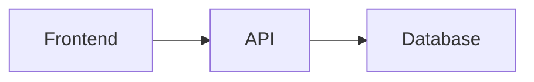
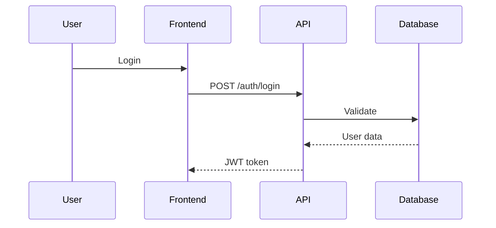
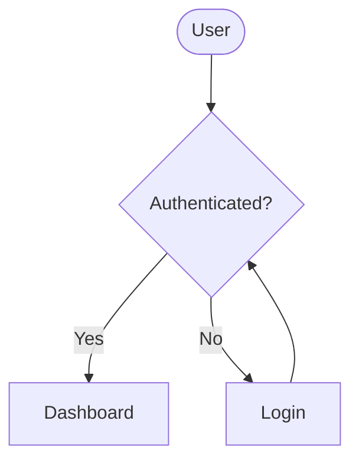
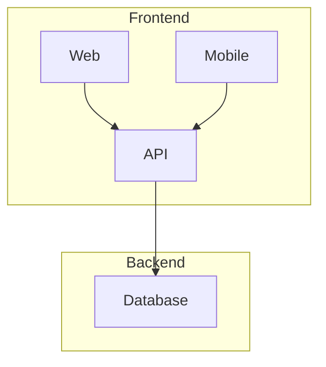
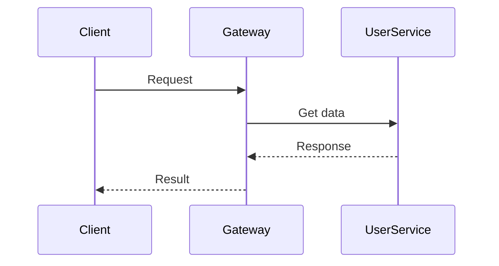

# Stop Uploading Diagram Screenshots to Your Documentation 📊

**That architecture diagram in your README? It's probably outdated.** 

You export from Figma → upload image → code changes → diagram becomes wrong → repeat forever.

**Better solution:** Embed live diagrams directly in markdown that update with your code.
<!--truncate-->
## The Problem We All Know

```
docs/images/
  architecture-v1.png ❌ (outdated)
  architecture-v2.png ❌ (also outdated) 
  api-flow-final.png ❌ (definitely not final)
```

Your `/images` folder is a graveyard of outdated diagrams.

## The Solution: Embedded Mermaid

Instead of managing image files, write text:

````markdown

````

**Result:** Live diagram that renders in GitHub, GitLab, Docusaurus, and most documentation platforms.

## Real Example: API Flow

````markdown

````

This renders as a beautiful, interactive diagram – no Figma, no exports, no broken links.

## Quick Start

**Choose your type:**
- System flow? → `flowchart TD`
- API calls? → `sequenceDiagram`
- Timeline? → `gantt`

**Basic syntax:**


## Why This Changes Everything

**Version Control:** Diagrams change with code in the same PR

**Always Current:** README reflects actual system, not 6-month-old screenshots

**Better Workflow:** Write docs in markdown, embed diagrams inline, renders everywhere

## Common Patterns

**System Architecture:**


**Service Communication:**


## Platform Support

Works natively in GitHub/GitLab, Docusaurus, GitBook, Obsidian, VS Code.

Test at [mermaid.live](https://mermaid.live)

## Pro Tips

- **Start simple:** Convert your main README diagram first
- **Stay focused:** Multiple small diagrams > one complex diagram  
- **Review process:** Include diagram updates in code reviews
- **Templates:** Create reusable patterns

## The Bottom Line

**Before:** Export → Upload → Outdated → Repeat
**After:** Write text → Renders everywhere → Always current

Your documentation becomes a living reflection of your system instead of outdated screenshots.

## Try This Today

Find one diagram image in your docs and replace it with embedded Mermaid. Copy any example above into a GitHub README and watch it render live.

**Who else is tired of managing diagram files?** Share your documentation struggles! 👇
[Read the full deep-dive](https://wiseagent.github.io/blogs/docs/mermaid-guide)
 #SoftwareEngineering #Documentation #GitHub #DeveloperProductivity