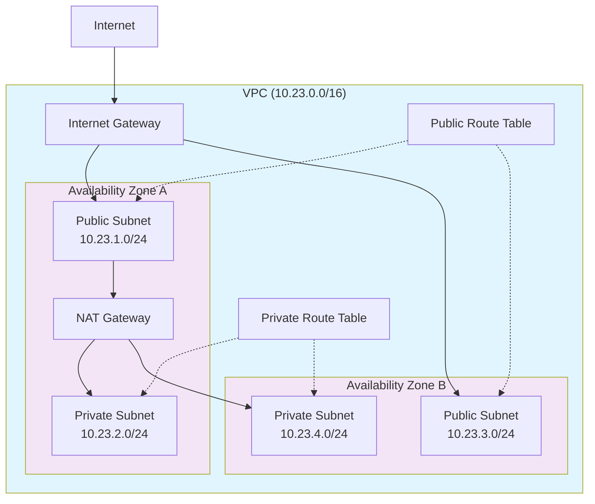

# Mastering AWS VPCs: Complete Guide to Creation, Architecture, and Troubleshooting

## AWS Tech Notes for DevOps Engineers

The Virtual Private Cloud (VPC) is the cornerstone of AWS networking, providing a logically isolated virtual network where you can launch AWS resources with complete control over your network environment. This comprehensive guide covers VPC creation, best practices for subnet architecture, and advanced troubleshooting techniques using both the AWS Management Console and CLI.

## Understanding VPC Fundamentals

### What is a VPC?

A VPC is your private network in the AWS cloud, offering:
- **Complete network isolation** from other AWS accounts
- **Full control** over IP addressing, subnets, route tables, and network gateways
- **Customisable security** through security groups and Network Access Control Lists (NACLs)
- **Flexible connectivity** options to the internet, other VPCs, and on-premises networks

### CIDR Block Planning and Selection

When designing your VPC, careful CIDR planning is crucial for scalability and network integration. AWS supports IPv4 CIDR blocks from `/16` (65,536 addresses) to `/28` (16 addresses).

#### Choosing Your CIDR Range

**Avoid Common Ranges**: Don't use obvious defaults like `10.0.0.0/16` or `192.168.1.0/24` as they frequently conflict with:
- Home and corporate networks
- Existing cloud environments
- VPN configurations
- On-premises infrastructure

**Better CIDR Selection Strategy:**
- **Use specific ranges**: `10.23.0.0/16`, `10.47.0.0/16`, or `10.100.0.0/16`
- **Align with organizational IP plans**: Reserve ranges for different environments
- **Consider future connectivity**: Plan for VPC peering, VPN, and Direct Connect

#### Key Planning Considerations

- **Plan for growth**: Choose appropriate block size based on projected needs
- **Avoid overlaps**: Ensure your CIDR doesn't conflict with existing networks or future expansion
- **Reserve space**: AWS reserves 5 IP addresses per subnet (first 4 and last 1)
- **Multiple AZs**: Plan subnets across multiple Availability Zones for high availability
- **Environment separation**: Use different CIDR ranges for prod/staging/dev

**Recommended CIDR Allocation Strategy:**
```
VPC: 10.23.0.0/16 (65,536 addresses)
├── Public Subnet AZ-A: 10.23.1.0/24 (256 addresses, 251 usable)
├── Private Subnet AZ-A: 10.23.2.0/24 (256 addresses, 251 usable)
├── Public Subnet AZ-B: 10.23.3.0/24 (256 addresses, 251 usable)
├── Private Subnet AZ-B: 10.23.4.0/24 (256 addresses, 251 usable)
└── Database Subnet AZ-A: 10.23.5.0/24 (256 addresses, 251 usable)
```

**Alternative Sizing for Different Use Cases:**
```
Small Application (/20 - 4,096 addresses):
VPC: 10.23.0.0/20
├── Allows 16 /24 subnets
└── Expandable with secondary CIDR blocks

Enterprise Multi-Environment:
├── Production: 10.20.0.0/16
├── Staging: 10.21.0.0/16  
├── Development: 10.22.0.0/16
└── Sandbox: 10.23.0.0/16
```

## VPC Creation Methods

### AWS Management Console

The console provides a user-friendly, wizard-driven approach:

1. **Navigate** to VPC service → "Create VPC"
2. **Choose** "VPC and more" for automated subnet creation, or "VPC only" for manual control
3. **Configure** essential parameters:
   - **Name**: Descriptive name (e.g., `production-vpc`)
   - **IPv4 CIDR**: Private IP range (e.g., `10.0.0.0/16`)
   - **IPv6 CIDR**: Optional, for future-proofing
   - **Tenancy**: Default (shared hardware) vs. Dedicated (isolated hardware)

**Pro Tip**: Use the "VPC and more" option to automatically create subnets, route tables, and internet gateway in a single step.

### AWS CLI

For Infrastructure as Code and automation, the CLI provides precise control:

```bash
# Create the VPC with intentionally chosen CIDR range
aws ec2 create-vpc \
    --cidr-block 10.23.0.0/16 \
    --tag-specifications 'ResourceType=vpc,Tags=[{Key=Name,Value=production-vpc}]'

# Enable DNS resolution and hostnames
aws ec2 modify-vpc-attribute --vpc-id vpc-12345678 --enable-dns-support
aws ec2 modify-vpc-attribute --vpc-id vpc-12345678 --enable-dns-hostnames
```

**Note**: Use double quotes for Windows PowerShell compatibility, or escape properly for your shell environment.

## Production-Ready VPC Architecture

### Multi-AZ Public and Private Subnet Design

A robust VPC architecture includes redundancy across multiple Availability Zones:

- **Public subnets**: Host internet-facing resources (load balancers, bastion hosts, NAT gateways)
- **Private subnets**: Host application servers, microservices, and other internal resources
- **Database subnets**: Isolate data tier with additional security controls

### Understanding Route Tables

Route tables are the traffic directors of your VPC:
- **Local route**: Automatically created for intra-VPC communication (e.g., `10.0.0.0/16 → local`)
- **Internet route**: Directs traffic to Internet Gateway (e.g., `0.0.0.0/0 → igw-12345`)
- **NAT route**: Directs private subnet traffic through NAT Gateway (e.g., `0.0.0.0/0 → nat-12345`)

Each subnet can only be associated with one route table, but one route table can serve multiple subnets.

## Complete CloudFormation Template

This production-ready template creates a VPC with multi-AZ architecture, proper routing, and essential security components:

```yaml
AWSTemplateFormatVersion: '2010-09-09'
Description: 'Production VPC with multi-AZ public/private subnets, NAT Gateway, and security components'

Parameters:
  VPCCidr:
    Description: CIDR block for VPC
    Type: String
    Default: 10.23.0.0/16
    
  EnvironmentName:
    Description: Environment name prefix for resources
    Type: String
    Default: production

Resources:
  # VPC with DNS support enabled
  VPC:
    Type: AWS::EC2::VPC
    Properties:
      CidrBlock: !Ref VPCCidr
      EnableDnsSupport: true
      EnableDnsHostnames: true
      Tags:
        - Key: Name
          Value: !Sub ${EnvironmentName}-vpc

  # Internet Gateway for public internet access
  InternetGateway:
    Type: AWS::EC2::InternetGateway
    Properties:
      Tags:
        - Key: Name
          Value: !Sub ${EnvironmentName}-igw

  # Attach Internet Gateway to VPC
  InternetGatewayAttachment:
    Type: AWS::EC2::VPCGatewayAttachment
    Properties:
      InternetGatewayId: !Ref InternetGateway
      VpcId: !Ref VPC

  # Public Subnet in AZ-A
  PublicSubnet1:
    Type: AWS::EC2::Subnet
    Properties:
      VpcId: !Ref VPC
      AvailabilityZone: !Select [0, !GetAZs '']
      CidrBlock: 10.23.1.0/24
      MapPublicIpOnLaunch: true
      Tags:
        - Key: Name
          Value: !Sub ${EnvironmentName}-public-subnet-az1

  # Public Subnet in AZ-B
  PublicSubnet2:
    Type: AWS::EC2::Subnet
    Properties:
      VpcId: !Ref VPC
      AvailabilityZone: !Select [1, !GetAZs '']
      CidrBlock: 10.23.3.0/24
      MapPublicIpOnLaunch: true
      Tags:
        - Key: Name
          Value: !Sub ${EnvironmentName}-public-subnet-az2

  # Private Subnet in AZ-A
  PrivateSubnet1:
    Type: AWS::EC2::Subnet
    Properties:
      VpcId: !Ref VPC
      AvailabilityZone: !Select [0, !GetAZs '']
      CidrBlock: 10.23.2.0/24
      Tags:
        - Key: Name
          Value: !Sub ${EnvironmentName}-private-subnet-az1

  # Private Subnet in AZ-B
  PrivateSubnet2:
    Type: AWS::EC2::Subnet
    Properties:
      VpcId: !Ref VPC
      AvailabilityZone: !Select [1, !GetAZs '']
      CidrBlock: 10.23.4.0/24
      Tags:
        - Key: Name
          Value: !Sub ${EnvironmentName}-private-subnet-az2

  # Elastic IP for NAT Gateway
  NatGateway1EIP:
    Type: AWS::EC2::EIP
    DependsOn: InternetGatewayAttachment
    Properties:
      Domain: vpc
      Tags:
        - Key: Name
          Value: !Sub ${EnvironmentName}-nat-gw-eip

  # NAT Gateway for private subnet internet access
  NatGateway1:
    Type: AWS::EC2::NatGateway
    Properties:
      AllocationId: !GetAtt NatGateway1EIP.AllocationId
      SubnetId: !Ref PublicSubnet1
      Tags:
        - Key: Name
          Value: !Sub ${EnvironmentName}-nat-gw

  # Route table for public subnets
  PublicRouteTable:
    Type: AWS::EC2::RouteTable
    Properties:
      VpcId: !Ref VPC
      Tags:
        - Key: Name
          Value: !Sub ${EnvironmentName}-public-routes

  # Route table for private subnets
  PrivateRouteTable1:
    Type: AWS::EC2::RouteTable
    Properties:
      VpcId: !Ref VPC
      Tags:
        - Key: Name
          Value: !Sub ${EnvironmentName}-private-routes-az1

  # Default route for public subnets to Internet Gateway
  DefaultPublicRoute:
    Type: AWS::EC2::Route
    DependsOn: InternetGatewayAttachment
    Properties:
      RouteTableId: !Ref PublicRouteTable
      DestinationCidrBlock: 0.0.0.0/0
      GatewayId: !Ref InternetGateway

  # Default route for private subnets to NAT Gateway
  DefaultPrivateRoute1:
    Type: AWS::EC2::Route
    Properties:
      RouteTableId: !Ref PrivateRouteTable1
      DestinationCidrBlock: 0.0.0.0/0
      NatGatewayId: !Ref NatGateway1

  # Associate public subnets with public route table
  PublicSubnet1RouteTableAssociation:
    Type: AWS::EC2::SubnetRouteTableAssociation
    Properties:
      RouteTableId: !Ref PublicRouteTable
      SubnetId: !Ref PublicSubnet1

  PublicSubnet2RouteTableAssociation:
    Type: AWS::EC2::SubnetRouteTableAssociation
    Properties:
      RouteTableId: !Ref PublicRouteTable
      SubnetId: !Ref PublicSubnet2

  # Associate private subnets with private route table
  PrivateSubnet1RouteTableAssociation:
    Type: AWS::EC2::SubnetRouteTableAssociation
    Properties:
      RouteTableId: !Ref PrivateRouteTable1
      SubnetId: !Ref PrivateSubnet1

  PrivateSubnet2RouteTableAssociation:
    Type: AWS::EC2::SubnetRouteTableAssociation
    Properties:
      RouteTableId: !Ref PrivateRouteTable1
      SubnetId: !Ref PrivateSubnet2

  # Default Security Group (automatically created, but explicitly referenced)
  DefaultSecurityGroup:
    Type: AWS::EC2::SecurityGroup
    Properties:
      GroupDescription: Default security group for VPC
      VpcId: !Ref VPC
      SecurityGroupIngress:
        - IpProtocol: -1
          SourceSecurityGroupId: !Ref 'AWS::NoValue'
      Tags:
        - Key: Name
          Value: !Sub ${EnvironmentName}-default-sg

Outputs:
  VPC:
    Description: VPC ID
    Value: !Ref VPC
    Export:
      Name: !Sub ${EnvironmentName}-VPC-ID

  PublicSubnets:
    Description: Public subnet IDs
    Value: !Join [",", [!Ref PublicSubnet1, !Ref PublicSubnet2]]
    Export:
      Name: !Sub ${EnvironmentName}-Public-Subnets

  PrivateSubnets:
    Description: Private subnet IDs  
    Value: !Join [",", [!Ref PrivateSubnet1, !Ref PrivateSubnet2]]
    Export:
      Name: !Sub ${EnvironmentName}-Private-Subnets
```

## VPC Architecture Diagram



## Security Considerations

### Network Access Control Lists (NACLs)

NACLs provide subnet-level security with stateless rules:
- **Default NACL**: Allows all inbound and outbound traffic
- **Custom NACLs**: Should follow principle of least privilege
- **Rule evaluation**: Processed in numerical order, lowest number first

### Security Groups

Security groups provide instance-level security with stateful rules:
- **Default behaviour**: Deny all inbound, allow all outbound
- **Stateful**: Return traffic automatically allowed
- **Best practice**: Create specific security groups for each application tier

### Example Security Group Configuration

```bash
# Web tier security group (public subnet)
aws ec2 create-security-group \
    --group-name web-tier-sg \
    --description "Security group for web servers" \
    --vpc-id vpc-12345678

# Allow HTTP and HTTPS from anywhere
aws ec2 authorize-security-group-ingress \
    --group-id sg-web12345 \
    --protocol tcp \
    --port 80 \
    --cidr 0.0.0.0/0

aws ec2 authorize-security-group-ingress \
    --group-id sg-web12345 \
    --protocol tcp \
    --port 443 \
    --cidr 0.0.0.0/0
```

## Advanced VPC Features

### VPC Endpoints

Reduce NAT Gateway costs and improve security by using VPC endpoints for AWS services:

```yaml
# S3 Gateway Endpoint (no charge)
S3Endpoint:
  Type: AWS::EC2::VPCEndpoint
  Properties:
    VpcId: !Ref VPC
    ServiceName: !Sub com.amazonaws.${AWS::Region}.s3
    VpcEndpointType: Gateway
    RouteTableIds:
      - !Ref PrivateRouteTable1

# Interface Endpoint for EC2 API (charges apply)
EC2Endpoint:
  Type: AWS::EC2::VPCEndpoint
  Properties:
    VpcId: !Ref VPC
    ServiceName: !Sub com.amazonaws.${AWS::Region}.ec2
    VpcEndpointType: Interface
    SubnetIds:
      - !Ref PrivateSubnet1
      - !Ref PrivateSubnet2
```

### Cost Optimization

**NAT Gateway Considerations:**
- **Charges**: $0.045/hour + $0.045/GB data processed (us-east-1 pricing)
- **Alternative**: NAT Instance for lower traffic workloads (manage your own EC2 instance)
- **Optimization**: Use VPC endpoints to avoid NAT Gateway for AWS service traffic

## Comprehensive Troubleshooting Guide

### CloudFormation Stack Failures

When your VPC CloudFormation deployment fails, follow this systematic approach:

#### Console-Based Troubleshooting

1. **Navigate to CloudFormation** → Select your failed stack
2. **Check Stack Status**: Look for `CREATE_FAILED`, `UPDATE_FAILED`, or `ROLLBACK_COMPLETE`
3. **Examine Events Tab**: 
   - Sort by timestamp to find the first failure
   - Look for resources with `CREATE_FAILED` status
   - Read the "Status reason" for specific error details

**Common Error Messages and Solutions:**

| Error | Likely Cause | Solution |
|-------|-------------|----------|
| `The CIDR '10.0.0.0/16' conflicts with another subnet` | CIDR overlap | Choose non-overlapping CIDR blocks |
| `Internet Gateway limit exceeded` | Too many IGWs in region | Delete unused IGWs or request limit increase |
| `InvalidSubnet: The subnet ID 'subnet-12345' does not exist` | Dependency issue | Check subnet creation succeeded first |
| `DependencyViolation: Gateway has dependent resources` | Resource dependencies | Delete dependent resources before gateway |

#### CLI-Based Troubleshooting

```bash
# Check overall stack status
aws cloudformation describe-stacks \
    --stack-name production-vpc-stack \
    --query 'Stacks[0].{Status:StackStatus,Reason:StackStatusReason}'

# Get detailed failure events
aws cloudformation describe-stack-events \
    --stack-name production-vpc-stack \
    --query 'StackEvents[?ResourceStatus==`CREATE_FAILED`]'

# List all stack resources and their status
aws cloudformation describe-stack-resources \
    --stack-name production-vpc-stack \
    --query 'StackResources[*].{LogicalId:LogicalResourceId,Type:ResourceType,Status:ResourceStatus}'
```

### VPC Connectivity Issues

#### Instances Can't Access Internet

**Diagnostic Steps:**
1. **Verify route table**: Ensure `0.0.0.0/0` points to Internet Gateway (public) or NAT Gateway (private)
2. **Check security groups**: Confirm outbound rules allow desired traffic
3. **Validate NACLs**: Ensure subnet-level rules permit traffic
4. **Test DNS resolution**: Verify DNS settings are enabled on VPC

```bash
# Check route table for a subnet
aws ec2 describe-route-tables \
    --filters "Name=association.subnet-id,Values=subnet-12345678" \
    --query 'RouteTables[0].Routes'

# Verify security group rules
aws ec2 describe-security-groups \
    --group-ids sg-12345678 \
    --query 'SecurityGroups[0].{Ingress:IpPermissions,Egress:IpPermissionsEgress}'
```

#### NAT Gateway Not Working

**Common Issues:**
- NAT Gateway not in public subnet
- Private route table doesn't point to NAT Gateway
- Security groups blocking traffic
- Source/destination check enabled on instances (for NAT instances)

**Verification Commands:**
```bash
# Check NAT Gateway status and location
aws ec2 describe-nat-gateways \
    --nat-gateway-ids nat-12345678 \
    --query 'NatGateways[0].{State:State,SubnetId:SubnetId,PublicIp:NatGatewayAddresses[0].PublicIp}'

# Verify private subnet routing
aws ec2 describe-route-tables \
    --filters "Name=association.subnet-id,Values=subnet-private123" \
    --query 'RouteTables[0].Routes[?DestinationCidrBlock==`0.0.0.0/0`]'
```

### VPC Flow Logs for Advanced Troubleshooting

Enable VPC Flow Logs to capture network traffic information:

```bash
# Create flow log for entire VPC
aws ec2 create-flow-logs \
    --resource-type VPC \
    --resource-ids vpc-12345678 \
    --traffic-type ALL \
    --log-destination-type cloud-watch-logs \
    --log-group-name VPCFlowLogs
```

Flow logs help identify:
- Rejected connections (security group/NACL blocks)
- Traffic patterns and volume
- Potential security threats
- Route table misconfigurations

## Best Practices and Production Considerations

### High Availability Design

- **Multi-AZ deployment**: Spread subnets across at least 2 AZs
- **Redundant NAT Gateways**: Deploy one per AZ for fault tolerance
- **Cross-AZ load balancing**: Use Application Load Balancers across AZs

### Monitoring and Alerting

- **VPC Flow Logs**: Enable for security and troubleshooting
- **CloudWatch Metrics**: Monitor NAT Gateway metrics for performance
- **AWS Config**: Track VPC configuration changes
- **AWS CloudTrail**: Audit API calls affecting VPC resources

### Tagging Strategy

Implement consistent tagging for cost allocation and management:

```yaml
Tags:
  - Key: Environment
    Value: production
  - Key: Project
    Value: web-app
  - Key: CostCenter
    Value: engineering
  - Key: Owner
    Value: devops-team
```

## Conclusion

Mastering VPCs requires understanding both the foundational concepts and the practical implementation details. By following the architectural patterns and troubleshooting approaches outlined in this guide, you'll be equipped to design, deploy, and maintain robust, secure, and cost-effective VPC infrastructures that scale with your organization's needs.

Remember that VPC design is often a one-time decision that's difficult to change later, so invest time in proper planning and consider future requirements when designing your network architecture.