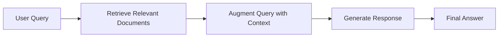

# Retrieval-Augmented Generation (RAG): A Comprehensive Guide

## Table of Contents
1. [Introduction: Why RAG Matters](#1-introduction-why-rag-matters)
2. [Core Concepts: How RAG Works](#2-core-concepts-how-rag-works)
3. [Technical Architecture](#3-technical-architecture)
4. [Implementation Guide](#4-implementation-guide)
5. [Real-World Applications](#5-real-world-applications)
6. [Advanced Techniques](#6-advanced-techniques)
7. [Production Considerations](#7-production-considerations)
8. [Common Pitfalls and Solutions](#8-common-pitfalls-and-solutions)
9. [Evaluation and Optimization](#9-evaluation-and-optimization)

---

## 1. Introduction: Why RAG Matters

Large Language Models (LLMs) have revolutionized how we interact with information, but they face fundamental limitations:

- **Knowledge cut-off**: Their information is frozen at training time
- **Hallucination**: They can generate plausible but factually incorrect information
- **Domain specificity**: They lack access to proprietary or specialized knowledge bases

**Retrieval-Augmented Generation (RAG)** addresses these challenges by connecting LLMs to external knowledge sources, enabling them to access current, factual, and domain-specific information before generating responses.

### Key Benefits

- **Accuracy**: Eliminates hallucinations by grounding responses in verified sources
- **Currency**: Provides access to real-time and up-to-date information
- **Customization**: Enables LLMs to work with proprietary or specialized data
- **Transparency**: Users can trace answers back to source documents
- **Cost-effectiveness**: Updates knowledge without expensive model retraining

---

## 2. Core Concepts: How RAG Works

### The Open-Book Exam Analogy

Think of RAG as transforming an LLM from a student taking a closed-book exam (relying only on memorized training data) to one taking an open-book exam (consulting specific, approved materials before answering).

### The RAG Pipeline

The RAG process follows three core steps:

1. **Retrieve**: Find relevant information from a knowledge base
2. **Augment**: Combine the retrieved context with the original query
3. **Generate**: Use the LLM to synthesize a response based on the provided context



---

## 3. Technical Architecture

### Core Components

#### 3.1 The Retriever: Expert Librarian

The Retriever's role is to find the most relevant information from your knowledge base.

**Process:**
1. **Document Processing**: Source documents are chunked into manageable segments
2. **Embedding Generation**: Text chunks are converted to vector embeddings using specialized models
3. **Vector Storage**: Embeddings are stored in vector databases optimized for similarity search
4. **Query Processing**: User queries are embedded using the same model
5. **Similarity Search**: The system finds chunks with embeddings most similar to the query

**Key Technologies:**
- **Embedding Models**: OpenAI's text-embedding-3-large, sentence-transformers, Cohere Embed
- **Vector Databases**: Pinecone, Weaviate, Chroma, Qdrant, Milvus
- **Similarity Metrics**: Cosine similarity, Euclidean distance, dot product

#### 3.2 The Generator: Eloquent Synthesizer

The Generator is an LLM that creates human-readable responses using both the original query and retrieved context.

**Popular Models:**
- OpenAI GPT-4 series
- Anthropic Claude
- Meta Llama 2/3
- Google Gemini

### 3.3 Vector Embeddings Deep Dive

Vector embeddings are numerical representations that capture semantic meaning:

```python
# Example: Text to embedding conversion
text = "What causes climate change?"
embedding = embedding_model.encode(text)
# Result: [0.234, -0.567, 0.891, ...] (typically 768-4096 dimensions)
```

**Quality factors:**
- **Dimensionality**: Higher dimensions can capture more nuanced relationships
- **Training data**: Models trained on domain-relevant data perform better
- **Context window**: Longer context windows preserve more semantic information

---

## 4. Implementation Guide

### 4.1 Basic RAG Implementation

```python
from langchain.document_loaders import WebBaseLoader, PyPDFLoader
from langchain.text_splitter import RecursiveCharacterTextSplitter
from langchain.embeddings import OpenAIEmbeddings
from langchain.vectorstores import Chroma
from langchain.chat_models import ChatOpenAI
from langchain.chains import RetrievalQA

# Step 1: Document Loading and Processing
def setup_knowledge_base(sources):
    documents = []
    
    # Load documents from various sources
    for source in sources:
        if source.endswith('.pdf'):
            loader = PyPDFLoader(source)
        else:
            loader = WebBaseLoader(source)
        documents.extend(loader.load())
    
    # Split documents into chunks
    text_splitter = RecursiveCharacterTextSplitter(
        chunk_size=1000,
        chunk_overlap=200,
        separators=["\n\n", "\n", ".", "!", "?", ",", " ", ""]
    )
    chunks = text_splitter.split_documents(documents)
    
    # Create vector store
    embeddings = OpenAIEmbeddings(model="text-embedding-3-large")
    vectorstore = Chroma.from_documents(
        documents=chunks,
        embedding=embeddings,
        persist_directory="./vectorstore"
    )
    
    return vectorstore

# Step 2: RAG Chain Setup
def create_rag_chain(vectorstore):
    llm = ChatOpenAI(
        model="gpt-4",
        temperature=0.1  # Lower temperature for factual responses
    )
    
    retriever = vectorstore.as_retriever(
        search_type="similarity",
        search_kwargs={"k": 5}  # Retrieve top 5 relevant chunks
    )
    
    # Create RAG chain with custom prompt
    qa_chain = RetrievalQA.from_chain_type(
        llm=llm,
        chain_type="stuff",
        retriever=retriever,
        return_source_documents=True,
        chain_type_kwargs={
            "prompt": create_custom_prompt()
        }
    )
    
    return qa_chain

def create_custom_prompt():
    from langchain.prompts import PromptTemplate
    
    template = """Use the following context to answer the question. 
    If you cannot find the answer in the context, say "I don't have enough information to answer this question."
    
    Context: {context}
    
    Question: {question}
    
    Answer: """
    
    return PromptTemplate(
        template=template,
        input_variables=["context", "question"]
    )

# Step 3: Usage
def query_rag_system(chain, question):
    result = chain({"query": question})
    
    return {
        "answer": result["result"],
        "sources": [doc.metadata.get("source", "Unknown") 
                   for doc in result["source_documents"]]
    }

# Example usage
if __name__ == "__main__":
    sources = ["company_docs.pdf", "https://example.com/knowledge-base"]
    vectorstore = setup_knowledge_base(sources)
    rag_chain = create_rag_chain(vectorstore)
    
    response = query_rag_system(rag_chain, "What is our company's remote work policy?")
    print(f"Answer: {response['answer']}")
    print(f"Sources: {response['sources']}")
```

### 4.2 Advanced Chunking Strategies

```python
def semantic_chunking(documents, embedding_model, similarity_threshold=0.8):
    """Implement semantic-based chunking instead of fixed-size chunks."""
    chunks = []
    current_chunk = []
    
    sentences = split_into_sentences(documents)
    embeddings = embedding_model.encode(sentences)
    
    for i, sentence in enumerate(sentences):
        if not current_chunk:
            current_chunk.append(sentence)
            continue
            
        # Calculate similarity with current chunk
        chunk_embedding = np.mean([embeddings[j] for j in range(len(current_chunk))], axis=0)
        similarity = cosine_similarity([embeddings[i]], [chunk_embedding])[0][0]
        
        if similarity > similarity_threshold:
            current_chunk.append(sentence)
        else:
            # Start new chunk
            chunks.append(' '.join(current_chunk))
            current_chunk = [sentence]
    
    # Add final chunk
    if current_chunk:
        chunks.append(' '.join(current_chunk))
    
    return chunks
```

### 4.3 Multi-Modal RAG

```python
from langchain.document_loaders import UnstructuredFileLoader
from langchain.schema import Document

def process_multimodal_documents(file_path):
    """Process documents containing text, images, and tables."""
    
    # Extract text, images, and tables
    loader = UnstructuredFileLoader(file_path, mode="elements")
    elements = loader.load()
    
    documents = []
    for element in elements:
        if element.metadata.get("category") == "Image":
            # Process image with vision model
            image_description = describe_image(element.metadata["image_path"])
            doc = Document(
                page_content=f"Image description: {image_description}",
                metadata={"type": "image", "source": file_path}
            )
            documents.append(doc)
        elif element.metadata.get("category") == "Table":
            # Process table structure
            table_content = structure_table(element.page_content)
            doc = Document(
                page_content=f"Table data: {table_content}",
                metadata={"type": "table", "source": file_path}
            )
            documents.append(doc)
        else:
            # Regular text processing
            documents.append(element)
    
    return documents
```

---

## 5. Real-World Applications

### 5.1 Customer Support Automation

**Scenario**: E-commerce company automates product support using RAG.

```python
class CustomerSupportRAG:
    def __init__(self):
        self.setup_knowledge_base([
            "product_manuals/",
            "faq_database.json",
            "troubleshooting_guides/"
        ])
    
    def handle_support_query(self, query, customer_data):
        # Enhance query with customer context
        enhanced_query = f"""
        Customer Profile: {customer_data.get('tier', 'standard')} customer
        Purchase History: {customer_data.get('recent_purchases', [])}
        
        Support Question: {query}
        """
        
        response = self.rag_chain(enhanced_query)
        
        # Add escalation logic
        if self.requires_human_escalation(response):
            return self.create_escalation_ticket(query, response)
        
        return response
```

### 5.2 Legal Document Analysis

```python
class LegalRAG:
    def __init__(self):
        self.setup_specialized_embeddings()  # Legal domain-specific embeddings
        self.load_legal_documents([
            "case_law_database/",
            "statutes/",
            "regulations/"
        ])
    
    def analyze_contract(self, contract_text, analysis_type="risk_assessment"):
        relevant_cases = self.retrieve_similar_cases(contract_text)
        applicable_laws = self.retrieve_applicable_statutes(contract_text)
        
        analysis_prompt = f"""
        Analyze this contract for {analysis_type}.
        
        Contract: {contract_text}
        
        Relevant Case Law: {relevant_cases}
        Applicable Statutes: {applicable_laws}
        
        Provide analysis with specific legal citations.
        """
        
        return self.llm.generate(analysis_prompt)
```

### 5.3 Scientific Research Assistant

```python
class ResearchRAG:
    def __init__(self):
        self.setup_scientific_databases([
            "arxiv_papers/",
            "pubmed_abstracts/",
            "patent_database/"
        ])
    
    def literature_review(self, research_topic, date_range=None):
        # Retrieve relevant papers with recency bias
        papers = self.retrieve_papers(
            topic=research_topic,
            date_range=date_range,
            citation_threshold=10  # Minimum citations
        )
        
        # Generate comprehensive literature review
        review = self.generate_review(papers, research_topic)
        
        return {
            "summary": review,
            "key_papers": papers[:10],
            "research_gaps": self.identify_gaps(papers, research_topic),
            "methodology_trends": self.analyze_methodologies(papers)
        }
```

---

## 6. Advanced Techniques

### 6.1 Hybrid Search

Combines semantic search with traditional keyword search for improved retrieval:

```python
from rank_bm25 import BM25Okapi

class HybridRetriever:
    def __init__(self, documents):
        # Semantic search setup
        self.vector_store = self.create_vector_store(documents)
        
        # Keyword search setup
        tokenized_docs = [doc.split() for doc in documents]
        self.bm25 = BM25Okapi(tokenized_docs)
        self.documents = documents
    
    def retrieve(self, query, alpha=0.7):
        # Semantic search
        semantic_scores = self.vector_store.similarity_search_with_score(query, k=20)
        
        # Keyword search
        keyword_scores = self.bm25.get_scores(query.split())
        
        # Combine scores
        combined_scores = {}
        for doc, score in semantic_scores:
            combined_scores[doc.page_content] = alpha * score
        
        for i, score in enumerate(keyword_scores):
            doc_content = self.documents[i]
            if doc_content in combined_scores:
                combined_scores[doc_content] += (1 - alpha) * score
            else:
                combined_scores[doc_content] = (1 - alpha) * score
        
        # Return top results
        return sorted(combined_scores.items(), key=lambda x: x[1], reverse=True)[:5]
```

### 6.2 Re-ranking and Query Expansion

```python
from sentence_transformers import CrossEncoder

class AdvancedRAG:
    def __init__(self):
        self.base_retriever = self.setup_base_retriever()
        self.reranker = CrossEncoder('cross-encoder/ms-marco-MiniLM-L-6-v2')
        self.query_expander = self.setup_query_expansion_model()
    
    def enhanced_retrieve(self, query, top_k=5):
        # Step 1: Query expansion
        expanded_queries = self.query_expander.expand(query)
        
        # Step 2: Initial retrieval with expanded queries
        all_candidates = []
        for exp_query in expanded_queries:
            candidates = self.base_retriever.get_relevant_documents(exp_query)
            all_candidates.extend(candidates)
        
        # Step 3: De-duplication and re-ranking
        unique_candidates = self.deduplicate(all_candidates)
        
        # Step 4: Re-rank using cross-encoder
        query_doc_pairs = [(query, doc.page_content) for doc in unique_candidates]
        rerank_scores = self.reranker.predict(query_doc_pairs)
        
        # Step 5: Return top-k re-ranked results
        scored_docs = list(zip(unique_candidates, rerank_scores))
        return sorted(scored_docs, key=lambda x: x[1], reverse=True)[:top_k]
```

### 6.3 Contextual Compression

```python
from langchain.retrievers import ContextualCompressionRetriever
from langchain.retrievers.document_compressors import LLMChainExtractor

def setup_compression_retriever(base_retriever, llm):
    """Create a retriever that compresses retrieved documents."""
    
    compressor = LLMChainExtractor.from_llm(
        llm=llm,
        prompt_template="""
        Extract only the information directly relevant to the question.
        Remove any irrelevant context while preserving key facts and details.
        
        Question: {question}
        
        Document: {context}
        
        Relevant information:
        """
    )
    
    return ContextualCompressionRetriever(
        base_compressor=compressor,
        base_retriever=base_retriever
    )
```

---

## 7. Production Considerations

### 7.1 Scalability Architecture

```python
import asyncio
from concurrent.futures import ThreadPoolExecutor
import redis

class ProductionRAG:
    def __init__(self):
        # Redis for caching
        self.redis_client = redis.Redis(host='localhost', port=6379, db=0)
        
        # Thread pool for parallel processing
        self.executor = ThreadPoolExecutor(max_workers=10)
        
        # Load balancing for multiple vector stores
        self.vector_stores = self.setup_distributed_vector_stores()
    
    async def query_with_caching(self, query):
        # Check cache first
        cache_key = f"rag_query:{hash(query)}"
        cached_result = self.redis_client.get(cache_key)
        
        if cached_result:
            return json.loads(cached_result)
        
        # Parallel retrieval from multiple stores
        tasks = [
            self.query_vector_store(store, query) 
            for store in self.vector_stores
        ]
        
        results = await asyncio.gather(*tasks)
        
        # Merge and rank results
        final_result = self.merge_results(results)
        
        # Cache result
        self.redis_client.setex(
            cache_key, 
            3600,  # 1 hour TTL
            json.dumps(final_result)
        )
        
        return final_result
    
    def setup_monitoring(self):
        """Setup monitoring for production RAG system."""
        import logging
        from prometheus_client import Counter, Histogram
        
        # Metrics
        self.query_counter = Counter('rag_queries_total', 'Total RAG queries')
        self.response_time = Histogram('rag_response_time_seconds', 'RAG response time')
        self.retrieval_accuracy = Histogram('rag_retrieval_accuracy', 'Retrieval accuracy')
        
        # Logging
        logging.basicConfig(
            level=logging.INFO,
            format='%(asctime)s - %(name)s - %(levelname)s - %(message)s',
            handlers=[
                logging.FileHandler('rag_system.log'),
                logging.StreamHandler()
            ]
        )
```

### 7.2 Security and Privacy

```python
class SecureRAG:
    def __init__(self):
        self.user_permissions = self.load_user_permissions()
        self.data_classifier = self.setup_data_classification()
    
    def secure_query(self, query, user_id):
        # Input validation and sanitization
        if not self.validate_query(query):
            raise ValueError("Invalid query format")
        
        # Check user permissions
        allowed_sources = self.get_user_sources(user_id)
        
        # Filter retrieval based on permissions
        filtered_retriever = self.create_filtered_retriever(allowed_sources)
        
        # Perform retrieval with access controls
        results = filtered_retriever.get_relevant_documents(query)
        
        # Post-process to remove sensitive information
        sanitized_results = self.sanitize_results(results, user_id)
        
        # Audit logging
        self.log_access(user_id, query, [r.metadata.get('source') for r in results])
        
        return sanitized_results
    
    def detect_prompt_injection(self, query):
        """Detect potential prompt injection attacks."""
        injection_patterns = [
            r"ignore previous instructions",
            r"system prompt",
            r"you are now",
            r"forget everything"
        ]
        
        for pattern in injection_patterns:
            if re.search(pattern, query.lower()):
                return True
        return False
```

### 7.3 Cost Optimization

```python
class CostOptimizedRAG:
    def __init__(self):
        self.embedding_cache = {}
        self.cheap_llm = ChatOpenAI(model="gpt-3.5-turbo")  # Cheaper for initial filtering
        self.expensive_llm = ChatOpenAI(model="gpt-4")      # More expensive for final generation
    
    def tiered_generation(self, query, context):
        # Use cheaper model for initial assessment
        initial_response = self.cheap_llm.predict(f"""
        Assess if this query requires complex reasoning or can be answered simply.
        Respond with 'SIMPLE' or 'COMPLEX'.
        
        Query: {query}
        Context: {context[:500]}  # Truncated context for cheaper processing
        """)
        
        if "SIMPLE" in initial_response:
            return self.cheap_llm.predict(f"Context: {context}\n\nQuery: {query}")
        else:
            return self.expensive_llm.predict(f"Context: {context}\n\nQuery: {query}")
    
    def batch_embedding_generation(self, texts, batch_size=100):
        """Generate embeddings in batches to reduce API costs."""
        all_embeddings = []
        
        for i in range(0, len(texts), batch_size):
            batch = texts[i:i + batch_size]
            
            # Check cache first
            cached_embeddings = []
            uncached_texts = []
            
            for text in batch:
                text_hash = hashlib.sha256(text.encode()).hexdigest()
                if text_hash in self.embedding_cache:
                    cached_embeddings.append(self.embedding_cache[text_hash])
                else:
                    uncached_texts.append(text)
            
            # Generate embeddings only for uncached texts
            if uncached_texts:
                new_embeddings = self.embedding_model.encode(uncached_texts)
                
                # Cache new embeddings
                for text, embedding in zip(uncached_texts, new_embeddings):
                    text_hash = hashlib.sha256(text.encode()).hexdigest()
                    self.embedding_cache[text_hash] = embedding
                
                all_embeddings.extend(new_embeddings)
            
            all_embeddings.extend(cached_embeddings)
        
        return all_embeddings
```

---

## 8. Common Pitfalls and Solutions

### 8.1 Data Quality Issues

**Problem**: Poor source data leads to incorrect or unhelpful responses.

**Solutions**:
```python
def validate_document_quality(documents):
    """Validate and clean documents before indexing."""
    validated_docs = []
    
    for doc in documents:
        # Check document length
        if len(doc.page_content) < 50:
            continue  # Skip very short documents
        
        # Check for meaningful content
        if is_meaningful_content(doc.page_content):
            # Clean and normalize
            cleaned_doc = clean_document(doc)
            validated_docs.append(cleaned_doc)
    
    return validated_docs

def is_meaningful_content(text):
    """Check if document contains meaningful content."""
    # Remove common non-meaningful patterns
    patterns_to_remove = [
        r"^Table of Contents",
        r"^Page \d+ of \d+",
        r"^Copyright \d{4}",
        r"^\s*\d+\s*$"  # Pages with only numbers
    ]
    
    for pattern in patterns_to_remove:
        if re.match(pattern, text.strip()):
            return False
    
    # Check for minimum word count and variety
    words = text.split()
    unique_words = set(words)
    
    return len(words) >= 20 and len(unique_words) / len(words) > 0.3
```

### 8.2 Retrieval Irrelevance

**Problem**: Retrieved documents are not relevant to the query.

**Solutions**:
```python
class ImprovedRetrieval:
    def __init__(self):
        self.relevance_threshold = 0.7
        self.max_results = 10
    
    def filtered_retrieval(self, query, vector_store):
        # Get more candidates than needed
        candidates = vector_store.similarity_search_with_score(
            query, 
            k=self.max_results * 2
        )
        
        # Filter by relevance threshold
        relevant_docs = [
            (doc, score) for doc, score in candidates 
            if score >= self.relevance_threshold
        ]
        
        # If too few results, lower threshold gradually
        if len(relevant_docs) < 3:
            threshold = self.relevance_threshold - 0.1
            relevant_docs = [
                (doc, score) for doc, score in candidates 
                if score >= threshold
            ]
        
        return [doc for doc, _ in relevant_docs[:self.max_results]]
    
    def query_expansion(self, original_query):
        """Expand query using synonyms and related terms."""
        expansion_prompt = f"""
        Generate 2-3 alternative phrasings of this query that maintain the same meaning:
        
        Original: {original_query}
        
        Alternatives:
        1.
        2.
        3.
        """
        
        expanded = self.llm.predict(expansion_prompt)
        return [original_query] + self.parse_alternatives(expanded)
```

### 8.3 Context Window Limitations

**Problem**: Too much retrieved context overwhelms the LLM's context window.

**Solutions**:
```python
def manage_context_window(retrieved_docs, max_tokens=8000):
    """Intelligently manage context to fit within token limits."""
    import tiktoken
    
    encoding = tiktoken.encoding_for_model("gpt-4")
    current_tokens = 0
    selected_docs = []
    
    # Sort documents by relevance score
    sorted_docs = sorted(retrieved_docs, key=lambda x: x[1], reverse=True)
    
    for doc, score in sorted_docs:
        doc_tokens = len(encoding.encode(doc.page_content))
        
        if current_tokens + doc_tokens <= max_tokens:
            selected_docs.append(doc)
            current_tokens += doc_tokens
        else:
            # Try to fit a truncated version
            remaining_tokens = max_tokens - current_tokens
            if remaining_tokens > 100:  # Minimum meaningful chunk
                truncated_content = truncate_to_tokens(
                    doc.page_content, 
                    remaining_tokens, 
                    encoding
                )
                truncated_doc = Document(
                    page_content=truncated_content,
                    metadata=doc.metadata
                )
                selected_docs.append(truncated_doc)
            break
    
    return selected_docs

def truncate_to_tokens(text, max_tokens, encoding):
    """Truncate text to fit within token limit while preserving meaning."""
    tokens = encoding.encode(text)
    
    if len(tokens) <= max_tokens:
        return text
    
    # Truncate at sentence boundaries when possible
    sentences = text.split('. ')
    truncated_text = ""
    current_tokens = 0
    
    for sentence in sentences:
        sentence_tokens = len(encoding.encode(sentence + '. '))
        if current_tokens + sentence_tokens <= max_tokens:
            truncated_text += sentence + '. '
            current_tokens += sentence_tokens
        else:
            break
    
    return truncated_text.strip()
```

---

## 9. Evaluation and Optimization

### 9.1 Evaluation Metrics

```python
class RAGEvaluator:
    def __init__(self):
        self.ground_truth_dataset = self.load_ground_truth()
    
    def evaluate_retrieval_quality(self, queries, retrieved_docs):
        """Evaluate retrieval component quality."""
        metrics = {
            'precision_at