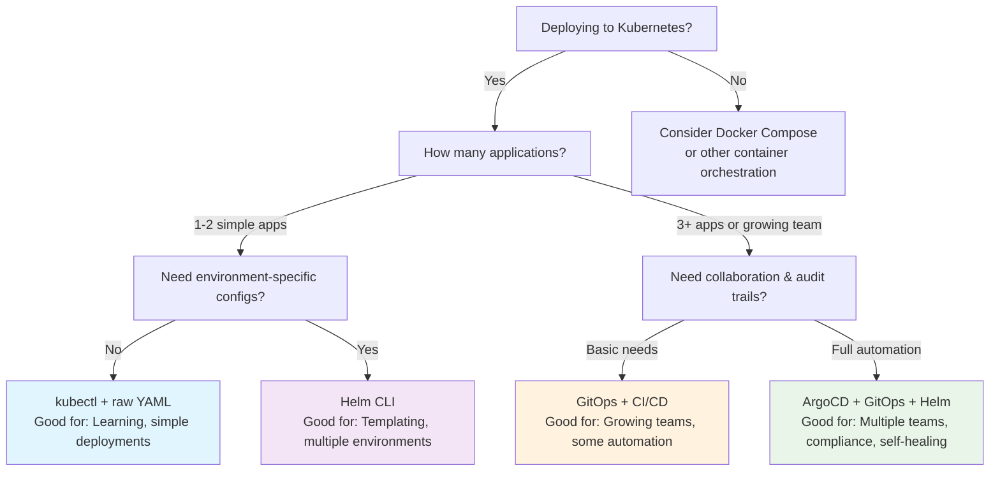

# Getting Started with Kubernetes Deployments: Helm, GitOps, and ArgoCD

## The Problem: Raw Kubernetes is Hard to Manage

When you first start deploying applications to Kubernetes, you'll likely begin with raw YAML files and `kubectl apply`. For a simple application, this might look like:

```bash
kubectl apply -f deployment.yaml
kubectl apply -f service.yaml  
kubectl apply -f ingress.yaml
```

This works fine for learning, but quickly becomes unmanageable as you add:
- Multiple environments (development, staging, production)
- Configuration variations between environments
- Multiple applications
- Team collaboration
- Change tracking and rollbacks

That's where Helm, GitOps, and ArgoCD come in. They solve these problems by adding structure, automation, and best practices to your Kubernetes deployments.

## Helm: The Kubernetes Package Manager

Think of Helm like `npm` for Node.js or `pip` for Python, but for Kubernetes applications. Instead of managing individual YAML files, you work with **Charts** - packaged applications that can be easily installed, upgraded, and shared.

### Key Concepts

**Helm Chart**: A directory structure containing all the Kubernetes YAML files needed to run an application, plus templates and configuration options.

```
my-web-app/
├── Chart.yaml          # Chart metadata
├── values.yaml         # Default configuration
├── templates/          # Kubernetes YAML templates
│   ├── deployment.yaml
│   ├── service.yaml
│   └── ingress.yaml
└── charts/            # Dependencies (other charts)
```

**Templates**: Instead of static YAML, Helm uses templates with placeholders:

```yaml
# templates/deployment.yaml
apiVersion: apps/v1
kind: Deployment
metadata:
  name: {{ .Values.appName }}
spec:
  replicas: {{ .Values.replicaCount }}
  template:
    spec:
      containers:
      - name: web
        image: {{ .Values.image.repository }}:{{ .Values.image.tag }}
```

**Values**: Configuration that gets plugged into templates:

```yaml
# values.yaml
appName: my-web-app
replicaCount: 2
image:
  repository: nginx
  tag: "1.21"
```

**Releases**: A deployed instance of a chart. You can have multiple releases of the same chart (e.g., `my-app-staging` and `my-app-production`).

### Basic Helm Commands

```bash
# Install a chart from a repository
helm install my-release bitnami/nginx

# Install your own chart with custom values
helm install my-app ./my-chart --values production-values.yaml

# Upgrade a release
helm upgrade my-app ./my-chart --set image.tag=v2.0.0

# See what's deployed
helm list

# Rollback to previous version
helm rollback my-app 1
```

### Why Helm Helps

- **Reusability**: One chart can deploy to multiple environments with different configurations
- **Versioning**: Track what version of your application is deployed where
- **Rollbacks**: Easy to revert to previous versions
- **Packaging**: Share applications with others through chart repositories

## GitOps: Infrastructure as Code, Git as Truth

GitOps is a way of managing infrastructure and applications where Git repositories become the single source of truth for what should be running in your systems.

### Core Principles

1. **Everything in Git**: All configuration, infrastructure definitions, and application manifests live in Git repositories
2. **Declarative**: You describe what you want (desired state), not how to get there
3. **Automated**: Tools automatically make your infrastructure match what's in Git
4. **Auditable**: Git history shows who changed what and when

### Traditional vs. GitOps Deployment

**Traditional (Push-based)**:
```
Developer → CI/CD Pipeline → kubectl apply → Kubernetes Cluster
```

**GitOps (Pull-based)**:
```
Developer → Git Repository → GitOps Controller → Kubernetes Cluster
```

### GitOps Repository Structure

A typical GitOps repository might look like:

```
k8s-deployments/
├── applications/
│   ├── web-app/
│   │   ├── base/              # Common configuration
│   │   └── environments/
│   │       ├── development/
│   │       ├── staging/
│   │       └── production/
│   └── api-service/
├── infrastructure/
│   ├── monitoring/
│   └── ingress/
└── clusters/
    ├── dev-cluster/
    └── prod-cluster/
```

### Benefits of GitOps

- **Visibility**: See exactly what's deployed by looking at Git
- **Rollbacks**: Revert to any previous Git commit
- **Collaboration**: Use standard Git workflows (pull requests, code reviews)
- **Disaster Recovery**: Rebuild entire environments from Git
- **Security**: No need to give deployment tools direct cluster access

## ArgoCD: GitOps Made Easy

ArgoCD is a tool that implements GitOps for Kubernetes. It continuously monitors Git repositories and automatically synchronizes your cluster to match what's defined in Git.

### How ArgoCD Works

1. **Repository Monitoring**: ArgoCD watches specified Git repositories for changes
2. **Desired State Comparison**: It compares what's in Git with what's running in the cluster
3. **Synchronization**: When differences are detected, ArgoCD updates the cluster to match Git
4. **Health Monitoring**: It continuously checks that applications are running correctly

### ArgoCD Application Definition

Here's how you tell ArgoCD about an application to manage:

```yaml
apiVersion: argoproj.io/v1alpha1
kind: Application
metadata:
  name: my-web-app
  namespace: argocd
spec:
  # Where to find the application definition
  source:
    repoURL: https://github.com/mycompany/k8s-configs
    path: applications/web-app/environments/production
    targetRevision: main
  
  # Where to deploy it
  destination:
    server: https://kubernetes.default.svc
    namespace: web-app
  
  # Sync policy
  syncPolicy:
    automated:
      selfHeal: true    # Fix manual changes automatically
      prune: true       # Remove resources not in Git
```

### ArgoCD Features

- **Web UI**: Visual dashboard showing application status and sync state
- **CLI Tool**: Command-line interface for managing applications
- **Multi-cluster Support**: Manage applications across multiple Kubernetes clusters
- **RBAC**: Role-based access control for different teams
- **Rollback**: Easy rollback to previous Git commits
- **Drift Detection**: Alerts when cluster state doesn't match Git

## Putting It All Together: A Complete Workflow

Here's how these tools work together in practice:

### 1. Create a Helm Chart
```bash
helm create my-web-app
# Edit templates and values.yaml
```

### 2. Store Chart in Git
```bash
git add my-web-app/
git commit -m "Add web app Helm chart"
git push origin main
```

### 3. Create ArgoCD Application
```yaml
# argocd-apps/web-app.yaml
apiVersion: argoproj.io/v1alpha1
kind: Application
metadata:
  name: web-app-prod
spec:
  source:
    repoURL: https://github.com/mycompany/helm-charts
    path: my-web-app
    targetRevision: main
    helm:
      valueFiles:
        - values-production.yaml
  destination:
    server: https://kubernetes.default.svc
    namespace: production
  syncPolicy:
    automated: {}
```

### 4. Deploy via Git
```bash
kubectl apply -f argocd-apps/web-app.yaml
```

### 5. Make Changes
```bash
# Update image tag in values-production.yaml
git add values-production.yaml
git commit -m "Update web app to v1.2.0"
git push origin main
# ArgoCD automatically deploys the change!
```

## Choosing Your Deployment Strategy

The key question isn't "which tool is best?" but rather "which tool fits my current needs?" Here's a decision tree to help:



## When to Use Each Tool

### Start with Helm if you need:
- Template-based configuration management
- Environment-specific deployments
- Application versioning and rollbacks
- Reusable application packages

### Add GitOps when you want:
- Audit trail of all changes
- Collaborative deployment workflows
- Disaster recovery capabilities
- Separation of code and deployment workflows

### Implement ArgoCD when you have:
- Multiple applications to manage
- Multiple environments or clusters
- Need for automated sync and drift detection
- Teams that need self-service deployments

## Common Beginner Mistakes

1. **Over-templating Helm charts**: Start simple, add complexity only when needed
2. **Putting secrets in Git**: Use tools like Sealed Secrets or external secret management
3. **Manual kubectl changes**: Resist the urge to fix things directly - always go through Git
4. **Ignoring resource limits**: Always set CPU and memory limits in your Helm charts
5. **Not testing locally**: Use `helm template` and `kubectl --dry-run` to test changes

## Next Steps

1. **Practice with Helm**: Create a simple chart for a basic web application
2. **Set up a GitOps repository**: Start with a single application and simple structure
3. **Install ArgoCD**: Try it in a development cluster first
4. **Learn kubectl basics**: These tools complement, don't replace, Kubernetes knowledge
5. **Understand YAML**: Get comfortable reading and writing Kubernetes manifests

## Learning Resources

- **Helm Documentation**: [helm.sh](https://helm.sh)
- **ArgoCD Getting Started**: [argo-cd.readthedocs.io](https://argo-cd.readthedocs.io)
- **GitOps Guide**: [www.gitops.tech](https://www.gitops.tech)
- **Kubernetes Basics**: [kubernetes.io/docs/tutorials/](https://kubernetes.io/docs/tutorials/)

Remember: these tools solve real problems, but they add complexity. Start simple, understand the problems you're trying to solve, and add sophistication gradually as your needs grow.