# Ditch Static Images – Embed Live Diagrams Directly in Your Markdown with Mermaid.js

## 🧠 TL;DR - Live Diagrams Beat Static Images


**The transformation:** From screenshots that break to diagrams that live in your documentation and update with your changes.

## 🎯 Why Embedded Mermaid Beats Image Files

**The old way:** Export from Figma → Upload image → Link breaks → Diagram outdated → Repeat

**The new way:** Write text → Renders everywhere → Always current → Version controlled

```mermaid
flowchart TD
    A[Static PNG/SVG Images] --> B[❌ Get outdated]
    A --> C[❌ Break when moved] 
    A --> D[❌ Not searchable]
    A --> E[❌ Hard to edit]
    
    F[Embedded Mermaid] --> G[✅ Always current]
    F --> H[✅ Live in markdown]
    F --> I[✅ Searchable text]
    F --> J[✅ Easy to update]
```



## 🚀 Start Here: 30 Seconds to Your First Embedded Diagram

Instead of adding `` to your markdown, just write:

````markdown

````

**Result:** Live, interactive diagram that renders directly in your markdown. No image files to manage, no broken links, no manual updates.

## 📊 Choose Your Diagram Type

Different problems need different diagrams:


**Quick decision guide:**
- Showing a process or system? → `flowchart`
- Documenting API interactions? → `sequenceDiagram`
- Planning project phases? → `gantt`
- Modeling data relationships? → `erDiagram`

## 🏗️ Master the Fundamentals

### Layout Direction - Changes Everything


**Pro tip:** Start with `LR` for most workflows, `TD` for org charts or decision trees.

### Node Shapes - Visual Language That Works


**When to use what:**
- `[text]` - Any process or action
- `(text)` - Start and end points
- `{text}` - Decision points, conditions
- `[[text]]` - Modules, components, subsystems

### Connections That Communicate


## 🎨 Make It Professional

### Smart Styling


**Available themes:** `base`, `dark`, `forest`, `neutral` (themes can be customized site-wide or per diagram)

**Pro styling tips:**
- Use `classDef` for consistent colors across related nodes
- Match your brand colors with custom theme variables
- Keep it simple - too many colors hurt readability

### Subgraphs - Organize Complex Systems


**Use subgraphs for:**
- Service boundaries in microservices
- Network zones (frontend/backend/external)
- Team ownership boundaries
- Deployment environments

## 💡 Real-World Examples That Work

### System Architecture

```mermaid
flowchart TD
    subgraph "Client"
        Mobile[📱 Mobile App]
        Web[🌐 Web App]
    end
    
    subgraph "API Gateway"
        Gateway[🚪 Kong Gateway]
    end
    
    subgraph "Services"
        User[👤 User Service]
        Order[🛒 Order Service]  
        Payment[💳 Payment Service]
    end
    
    subgraph "Data"
        UserDB[(👤 User DB)]
        OrderDB[(🛒 Order DB)]
        Cache[(⚡ Redis)]
    end
    
    Mobile --> Gateway
    Web --> Gateway
    Gateway --> User
    Gateway --> Order
    Gateway --> Payment
    
    User --> UserDB
    Order --> OrderDB
    Payment --> Cache
    
    classDef service fill:#3b82f6,stroke:#1e40af,stroke-width:2px,color:#fff
    classDef database fill:#10b981,stroke:#047857,stroke-width:2px,color:#fff
    
    class User,Order,Payment service
    class UserDB,OrderDB,Cache database
```


### API Flow Documentation


## ⚡ Implementation Guide

### GitHub/GitLab (Most Common)
Embedded diagrams work out of the box in:
- README.md files
- Wiki pages  
- Issue descriptions and comments
- Pull request descriptions
- Markdown files in repositories

````markdown

````

**Pro tip:** No need to manage image assets or worry about relative paths breaking.

### From Image Files to Embedded Diagrams
**Before:** Managing separate image files
```markdown
# System Architecture


# API Flow  

```

**After:** Everything embedded in markdown
```markdown
# System Architecture


# API Flow

```

**Benefits:**
- No `/docs/images/` folder to maintain
- No broken image links when files move
- Diagrams update in the same commit as code changes
- Searchable text instead of image content

## ⚡ Where Your Embedded Diagrams Work

**Platforms with native Mermaid support:**
- **GitHub/GitLab:** READMEs, wikis, issues, pull requests
- **Docusaurus:** Documentation sites with `@docusaurus/theme-mermaid`
- **GitBook:** Native rendering in pages
- **Obsidian:** Notes and knowledge bases
- **VS Code:** With Mermaid Preview extension
- **Notion:** Mermaid code blocks (limited support)

**The power:** Write once, renders everywhere. No more "Can you re-export that diagram?" requests.

## 🚨 Common Gotchas to Avoid

### Syntax Errors That Break Everything


**Watch out for:**
- Unquoted text with apostrophes, quotes, or special chars
- Missing spaces around arrows (`A-->B` should be `A --> B`)
- Inconsistent node IDs (case-sensitive)

### Performance Issues
- **Large diagrams:** Break into multiple subgraphs or separate diagrams
- **Complex styling:** Prefer themes over individual node styling
- **Too many connections:** Consider simplifying or using different diagram types

### Platform Differences
- **GitHub:** Slightly limited feature set vs. mermaid.live
- **Different themes:** Test in your target environment
- **Mobile rendering:** Some complex diagrams don't scale well

## 🎯 Best Practices for Teams

## 🎯 Best Practices for Embedded Diagrams

### Keep It Simple for Readability


**Rule of thumb:** If you need to scroll horizontally to see the whole diagram, it's too complex.

### Organize Complex Systems with Multiple Diagrams
Instead of one giant architecture diagram, create focused views:

````markdown
## High-Level Architecture


## Service Details  


## Data Flow

````

### Maintain Consistency


**Team conventions to establish:**
- Standard colors for different system types
- Consistent node shapes (rectangles for services, cylinders for databases)
- Naming conventions for clarity
- When to use subgraphs vs. separate diagrams

## 🏆 The Embedded Diagram Advantage

**Version Control Integration:**
- Diagrams change with code in the same pull request
- Git blame shows who changed architecture and when  
- Diff views show exactly what changed in your system design
- No more "the latest diagram is in someone's Google Drive"

**Always Current Documentation:**
- README files with embedded diagrams never show outdated architecture
- API documentation stays in sync with actual endpoints
- System diagrams update as services evolve
- No more "ignore that diagram, it's from 6 months ago"

**Better Developer Experience:**
- New team members see current system state immediately
- Code reviews include architectural changes
- Issues and PRs can include relevant diagrams inline
- Search works across diagram content, not just filenames

## 🔥 Advanced Patterns

### Clickable Interactive Diagrams
```mermaid
flowchart LR
    A[API Gateway] --> B[User Service]
    B --> C[Documentation]
    
    click A "https://kong.com" "API Gateway docs"
    click B "https://github.com/team/user-service" "User service repo"
    click C "https://docs.team.com/user-api" "API documentation"
```

**Works in:** GitHub, Docusaurus, most documentation platforms

### Dynamic Content Generation
```javascript
// Generate Mermaid from your API schema
function generateERDiagram(schema) {
  let diagram = 'erDiagram\n';
  
  schema.tables.forEach(table => {
    diagram += `  ${table.name} {\n`;
    table.columns.forEach(col => {
      diagram += `    ${col.type} ${col.name}\n`;
    });
    diagram += '  }\n';
  });
  
  return diagram;
}
```

### Integration with Documentation Generation
Many teams auto-generate Mermaid diagrams from:
- OpenAPI specs → sequence diagrams
- Database schemas → entity relationship diagrams  
- Code structure → class diagrams
- Deployment configs → architecture diagrams

## 🎯 Action Steps

**Today:**
1. Find one image diagram in your current documentation
2. Recreate it as embedded Mermaid using [mermaid.live](https://mermaid.live) 
3. Replace the `` with the Mermaid code block
4. Commit and see it render in your repository

**This week:**
1. Convert your main README architecture diagram
2. Add embedded diagrams to your API documentation
3. Replace process flow images with Mermaid flowcharts
4. Update your team's documentation standards

**This month:**
1. Establish team conventions for embedded diagram patterns
2. Add diagram reviews to your pull request process  
3. Create templates for common diagram types
4. Audit and convert remaining static diagrams

**Long term:**
1. Embedded diagrams become part of your definition of done
2. Architecture decisions include diagram updates
3. New services automatically get documented with embedded diagrams
4. Your documentation stays current without manual maintenance

## 🏆 Success Metrics

You'll know Mermaid is working when:
- Your diagrams are always up-to-date
- New team members understand systems faster
- Architecture discussions reference living diagrams
- Code reviews include diagram updates
- You never hear "where's the latest architecture diagram?"

---

**Ready to embed your first diagram?** Copy any Mermaid example above directly into your markdown file and watch it render as a live, interactive diagram. No more managing image files or dealing with broken links – just text that becomes beautiful, current documentation.