## 🧠 TL;DR - A Picture is Worth a Thousand Words


**The bottom line:** Turn `A --> B --> C` into professional diagrams that live in your code, update automatically, and never break when you refactor. No Visio, no Figma, no export headaches.

## 🎯 What You'll Gain in 2 Minutes

**Perfect for:** READMEs, technical docs, system designs, and any time you need to explain complex flows quickly.

---

## 🚀 Start Here: Your First Diagram


That's it. Three nodes, two arrows, zero design skills required.

---

## 📋 The Essential Syntax (Copy & Adapt)

### Diagram Types - Pick Your Tool

```mermaid
flowchart TD
    A[🔄 Flowchart<br/>Process flows] --> B[📞 Sequence<br/>API calls]
    B --> C[📊 Gantt<br/>Timelines] 
    C --> D[🧠 Mindmap<br/>Ideas]
    D --> E[🏗️ Class<br/>Code structure]
```


**Quick picker:**
- System workflow? → `flowchart`
- API documentation? → `sequenceDiagram` 
- Project planning? → `gantt`
- Brainstorming? → `mindmap`

### Layout Direction - One Line Changes Everything


**Pro tip:** `LR` works best for process flows, `TD` for hierarchies.

### Nodes - Shape Communicates Meaning


**Cheat sheet:**
- `A[text]` = Process step
- `A(text)` = Start/end state  
- `A{text}` = Decision point
- `A[[text]]` = Module/component

---

## 🎨 Make It Look Professional

### Quick Themes


**Available:** `default`, `dark`, `forest`, `neutral`

### Custom Styling


**Use cases:** Highlight critical paths, color-code by team/system, match brand colors.

---

## 🔗 Advanced Patterns That Save Time

### Subgraphs - Two Powerful Uses

**1. Visual Grouping** - Label related nodes under a box:


**2. Modular Flow** - Connect separate process sections:


**Use cases:** System boundaries, process phases, team responsibilities, architectural layers.

### Interactive Elements


**Works in:** GitHub, Docusaurus, GitBook, VS Code preview.

---

## 💡 Real-World Example: API Authentication


**Why this works:** Shows real API flow, includes security note, uses professional theme.

---

## ⚡ Implementation Guide

### 🟢 Easiest: GitHub/GitLab
Just wrap your code:
````markdown

````

### 🟡 Local Development
Install the CLI:
```bash
npm install -g @mermaid-js/mermaid-cli
mmdc -i input.mmd -o output.png
```

### 🔴 Advanced: Live Rendering
- **Docusaurus:** Built-in support
- **VS Code:** Mermaid Preview extension
- **Obsidian:** Native support
- **Online:** [mermaid.live](https://mermaid.live) for testing

---

## 🎯 Pro Tips for Success

**Start Simple:** Master flowcharts before moving to sequence diagrams
**Version Control:** Your diagrams evolve with your code - no more outdated Visio files
**Consistency:** Pick 2-3 diagram types and master them deeply
**Testing:** Always preview in your target environment (GitHub renders differently than Docusaurus)

---

## 🔥 Next Steps

1. **Try it now:** Copy any example above into a GitHub README
2. **Bookmark:** [mermaid.live](https://mermaid.live) for quick testing  
3. **Level up:** Add Mermaid to your documentation workflow this week

**Remember:** The best diagram is the one that gets created and maintained. Mermaid makes both easy.

> 💪 **You're ready.** Pick an existing process in your project and diagram it. Your future self (and teammates) will thank you.